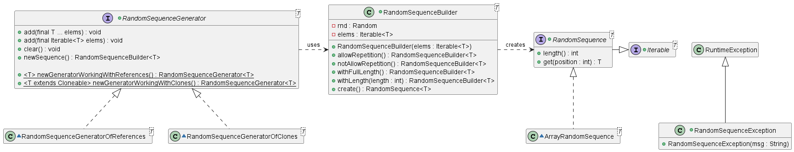

# Random Sequence Generator
 
<br>
The library provides classes to easily generate and handle random sequences of elements built from a given 
collection. 

## Index
- [Description](#description)
- [How it works?](#how-it-works)

## Description
The library provides classes to easily generate and handle random sequences of elements built form a given collection.
The basics are:
<ul>
<li><b>RandomSequence</b>: an Iterable of objects that apparently have been disposed randomly.</li>
<li><b>RandomSequenceBuilder</b>: it can generate RandomSequences from a collection of elements specifying their 
length and if they allow repetition of elements or not.</li>
<li><b>RandomSequenceGenerator</b>: it's basically a collection of elements that offer a shortcut to generate 
RandomSequence. It uses a RandomSequenceBuilder for that purpose.</li>
</ul> 



## How it works?

### Build a RandomSequence
```java
Card[] cards = {
    new Card(4,"Clubs"), new Card(7, "Diamonds"),
    new Card(3, "Hearts"), new Card(8, "Spades")
};
RandomSequence<Card> deck = new RandomSequenceBuilder<>(cards).create();
```
By default, the *RandomSequenceBuilder* will create *RandomSequences* using all elements available without repeating any. 
In this case, the deck would have four cards in some random order. 

### Read a RandomSequence
*RandomSequence* implements *Iterable*, so it's possible to iterate it in the common ways.
```java
// Using forEach method form Iterable
deck.forEach(card -> pick(card));

// Using for-each loop
for(Card card : deck) {
    pick(card);
}

// Using an Iterator
Iterator<Card> deckIterator = deck.iterator();
while(deckIterator.hasNext()) {
    Card card = deckIterator.next();
    pick(card);
}
```

A *RandomSequence* provides a method to get an element by its position.
```java
Card third = deck.get(3); 
```

### Build a RandomSequence with specified length
Sometimes, you will have a huge collection of elements, but the sequence only need some of them. In that case, you
can specify the length of the *RandomSequence*.
```java
List<Integer> numbers = IntStream.range(0, 100).boxed().toList();

RandomSequence<Integer> lottery = new RandomSequenceBuilder<>(numbers)
        .withLength(6)
        .create();
```

### Build a RandomSequence with repetition allowed
Other times, you will have a tiny collection of elements and the sequence need more than the available elements. In that
case, it's necessary to allow repetition. If not, a *RandomSequenceException* will be thrown. 
```java
RandomSequence<Coin> sample = new RandomSequenceBuilder<>(Coin.HEADS, Coin.TAILS)
        .allowRepetition()
        .withLength(100)
        .create();
```

### Using RandomSequenceGenerator to build sequences
You can always keep a *RandomSequenceBuilder*'s reference, and create sequences unlimited. But you can't change the 
available elements. If you need to modify the available elements between building, you can use a *RandomSequenceBuilder*.
```java
RandomSequenceGenerator<Product> productsCarousel = RandomSequenceGenerator.newGeneratorWorkingWithReferences();
productsCarousel.add(getProducts(ProductState.ON_SALE));
RandomSequence<Product> carousel1 = productsCarousel.newSequence()
        .withLength(3)
        .create();
.
.
.
productsCarousel.add(getProducts(ProductState.RECOMMENDED));
RandomSequence<Product> carousel2 = productsCarousel.newSequence()
        .withLength(3)
        .create();
```
The generators offered by the library are really simple. If you need something very specific, you can always create your
own implementation of *RandomSequenceGenerator*;

### Generator working with References vs Clones
The library offer two ways for working with *RandomSequenceGenerator*, and they differ on how the elements are sent to the
builder when *newSequence()* is called.

```java
// Creates a new generator whose generated sequence will be composed of references to the real elements of the generator.
RandomSequenceGenerator.newGeneratorWorkingWithReferences();

// Creates a new generator whose generated sequence will be composed of clones of the real elements of the generator.
RandomSequenceGenerator.newGeneratorWorkingWithClones();
```

It's important to know that, the type of elements used in a generator that works with clones, must implements Cloneable and
define an implementation for the *clone()* method.
